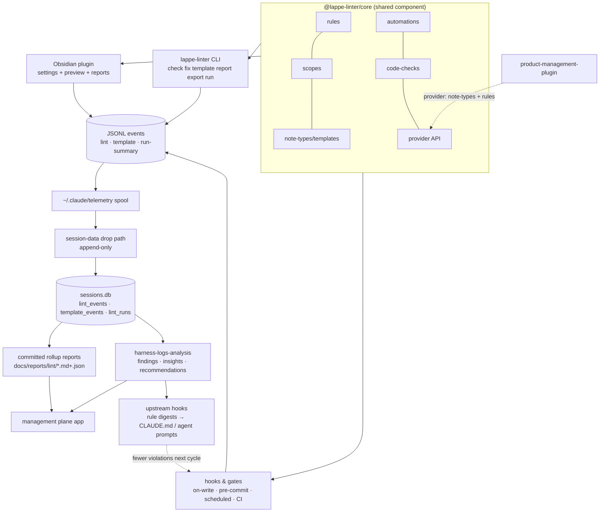
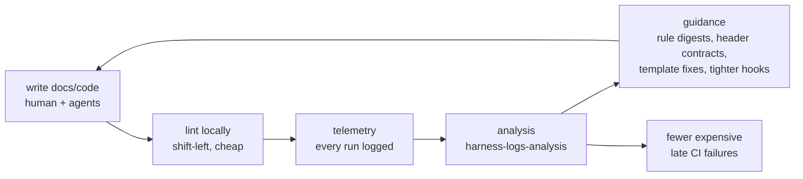
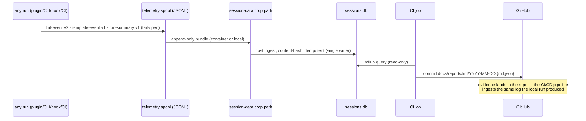
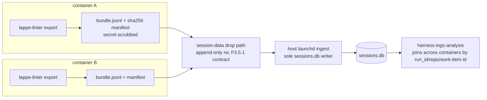

# Unified system — sketches

- Plan ID: `lappe-unified-system-v1-sketches`
- Status: `draft_for_review`
- Parent: `docs/plans/2026-07-17-unified-system-plan.md`

Every piece of the plan, visualized. ASCII wireframes render everywhere; mermaid diagrams render natively in Obsidian and GitHub.

---

## 1. System map



## 2. The flywheel



The loop compounds: each cycle moves detection earlier ("pushing left"), raises the quality bar the agents write against, and makes outcomes more deterministic. The data collected is itself the product that trains the next round of agent guidance.

## 3. Template hierarchy (global → property-scoped → rules/automations)

```
GLOBAL BASE TEMPLATE  (everybody inherits)
│   frontmatter seed · key order · body scaffold
│   pinned keys = attributes the template owns   [x] domain  [x] category  [ ] aliases
│
├── PROPERTY-BASED TEMPLATE: "projects"
│     match: folder Projects/** AND frontmatter type: project
│     inherits global; toggles OFF: aliases; overrides: key-order
│     │
│     └── rules & automations for this scope
│           rules: heading-casing=title, paragraph-spacing=1 …
│           automations: on-write(fix, fail-open) · pre-commit(check, fail-closed)
│
├── PROPERTY-BASED TEMPLATE: "daily notes"
│     match: folder Daily/** OR frontmatter type: daily
│     inherits global; toggles OFF: domain, category; adds: date-created pin
│     └── automations: on-create(apply-template) · nightly schedule(check → report)
│
└── (any note matching nothing gets global + defaults)
```

`linter.yaml` shape (extends the existing defaults/profiles design; comment-preserving like everything else):

```yaml
templates:
  global:
    pinned-keys: [domain, category, sub-category]   # template-owned; children may toggle off
    key-order: [domain, category, sub-category, date-created, date-revised, type, status, aliases, tags]
    frontmatter:
      status: NEW
    body: |
      # {{title}}

      ## Notes
  by-scope:
    - name: projects
      extends: global
      match: { path: ["Projects/**"], frontmatter: { type: project } }
      toggles: { aliases: off }          # inherited attribute switched off here
      pinned-keys: [domain, category, project]

automations:
  - name: lint-on-write        # fired by PostToolUse hook
    trigger: on-write
    action: fix
    failure: open              # never blocks authoring
    log: spool
  - name: gate                 # fired by pre-commit / CI
    trigger: pre-commit
    action: check
    failure: closed
    log: spool
  - name: nightly-sweep
    trigger: schedule "0 2 * * *"
    scope: { path: ["**/*.md"] }
    action: check
    report: md                 # writes docs/reports/lint/…
```

Inheritance semantics stay what the core already implements: AND across scope types, OR within a type's values; per-option override vs. reset-to-inherited; `pushDefaultsToProfiles` re-links children when the base changes.

## 4. Obsidian settings — left-hand hierarchical nav

Extends the existing vertical nav (`linter-navigation-item`); no new UI paradigm, just hierarchy. Same pattern reused by the PM plugin and the management plane so the whole product family navigates identically.

```
┌───────────────────────────┬──────────────────────────────────────────────┐
│ ⚙ Lappe Linter            │  Templates ▸ projects                        │
│                           │ ─────────────────────────────────────────── │
│  General                  │  Inherits: Global base        [view base]    │
│  YAML                     │                                              │
│  Headers                  │  Scope                                       │
│  Body                     │   folder  Projects/**              [+ add]   │
│  Special formatting       │   property type = project          [+ add]   │
│  ▾ Templates              │                                              │
│     Global base           │  Attributes (inherited from base)            │
│     ▸ projects        ◀   │   [x] domain        pinned by base           │
│     ▸ daily notes         │   [x] category      pinned by base           │
│     + new template        │   [ ] aliases       toggled off here  ↺      │
│  ▾ Rules & automations    │                                              │
│     Rule order            │  Key order                     [customize]   │
│     Scopes                │   domain · category · … (drag to reorder)    │
│     Automations           │                                              │
│  Reports                  │  Body scaffold                    [edit]     │
│  Custom                   │                                              │
│  Debug                    │  [Preview side-by-side]  [Push base changes] │
└───────────────────────────┴──────────────────────────────────────────────┘
```

`↺` = reset-to-inherited. Every row shows whether a value is inherited, overridden here, or pinned by the base.

## 5. Rules & automations editor

```
┌───────────────────────────┬──────────────────────────────────────────────┐
│  …                        │  Rules & automations ▸ Automations           │
│  ▾ Rules & automations    │ ─────────────────────────────────────────── │
│     Rule order            │  NAME           WHEN          HOW     LOG    │
│     Scopes                │  lint-on-write  on write      fix ▾  spool   │
│     Automations       ◀   │                 fail-open ▾                  │
│                           │  gate           pre-commit    check  spool   │
│                           │                 fail-closed                  │
│                           │  nightly-sweep  02:00 daily   check  report  │
│                           │                                              │
│                           │  [+ new automation]                          │
│                           │                                              │
│                           │  ▸ scope: which templates/profiles it hits   │
│                           │  ▸ run now (fires CLI: lappe-linter run …)   │
└───────────────────────────┴──────────────────────────────────────────────┘
```

## 6. Reports surface (plugin · CLI · management plane render the same data)

```
┌───────────────────────────┬──────────────────────────────────────────────┐
│  …                        │  Reports ▸ Last 30 days                      │
│  Reports              ◀   │ ─────────────────────────────────────────── │
│                           │  Lint runs   412   Files fixed  1,208        │
│                           │  Template invocations  186   Repos  6        │
│                           │                                              │
│                           │  TEMPLATE USAGE BY REPO                      │
│                           │  lappe-linter     ████████████  74           │
│                           │  harness          ████████      52           │
│                           │  product-mgmt     █████         31           │
│                           │  sports-vaults    ███           18           │
│                           │                                              │
│                           │  TOP RULES FIRED                 trend       │
│                           │  yaml-key-sort          321       ▂▄▆█ ↑     │
│                           │  heading-blank-lines    214       █▆▄▂ ↓     │
│                           │  paragraph-spacing      188       ▄▄▄▄ →     │
│                           │     [promote to agent guidance]              │
│                           │                                              │
│                           │  WHAT IS BEING LINTED (coverage)             │
│                           │  Projects/  ✓ on-write+gate   Daily/ ✓ sweep │
│                           │  Archive/   ⚠ no automation bound            │
└───────────────────────────┴──────────────────────────────────────────────┘
```

"Promote to agent guidance" is the flywheel button: it drafts the digest entry that upstream hooks/CLAUDE.md ingest, so frequent violations start getting prevented at authoring time.

## 7. CLI (the same engine, headless)

```console
$ lappe-linter check Projects/ --json          # gate mode, output-version 2
$ lappe-linter fix --changed                   # pre-commit lane
$ lappe-linter template list
GLOBAL  global base        pinned: domain, category, sub-category
SCOPED  projects           Projects/** + type:project    toggles: -aliases
SCOPED  daily notes        Daily/** | type:daily         toggles: -domain -category
$ lappe-linter template apply Projects/new-note.md --dry-run
$ lappe-linter run nightly-sweep               # what launchd/cron/CI invoke
$ lappe-linter report --since 2026-06-17 --md > docs/reports/lint/2026-07-17.md
$ lappe-linter export --out ~/exports/         # checksummed, secret-scrubbed bundle
```

## 8. Telemetry pipeline



Event shapes (versioned in `packages/core`):

```jsonc
// lint-event v2 — one per violation (extends output-version 1)
{"v":2,"kind":"lint","ts":"…","run_id":"…","trigger":"on-write","repo":"lappe-linter",
 "path":"Projects/a.md","profile":"projects","rule":"yaml-key-sort","action":"fix",
 "fixed":true,"message":"…","duration_ms":4}

// template-event v1 — one per template touch
{"v":1,"kind":"template","ts":"…","run_id":"…","trigger":"on-create","repo":"harness",
 "path":"Daily/2026-07-17.md","template":"daily notes","scope_matched":["folder","frontmatter"],
 "keys_applied":["date-created","status"],"toggles_overridden":[],"mode":"apply"}

// run-summary v1 — one per run
{"v":1,"kind":"run","run_id":"…","trigger":"pre-commit","repo":"lappe-linter",
 "files_scanned":42,"files_changed":3,"violations":9,"fixes":9,
 "templates_invoked":2,"exit_code":0,"ts_start":"…","ts_end":"…"}
```

## 9. Cross-container export (v1 manual, v2 automated)



Security posture: bundles carry no secrets (reuse the ingestor's scrub pass before write), content-hashes make re-import idempotent, readers mount read-only per `access-v1`, and no new process ever writes `sessions.db` directly. v2 automates the drop (scheduled export automation) without changing the trust boundaries.

## 10. Management plane app (wireframes; full design in companion doc)

Shell — same left-nav hierarchy as the plugin:

```
┌────────────────────────┬─────────────────────────────────────────────────┐
│ ⌂ <NAME TBD>           │  Home                                           │
│                        │  ┌───────────┐ ┌───────────┐ ┌───────────┐      │
│  Home                  │  │ 47 scripts│ │ 3 sched.  │ │ 2 drifted │      │
│  ▾ Scripts & autom.    │  │ 12 active │ │ jobs today│ │ CI configs│      │
│     By project         │  └───────────┘ └───────────┘ └───────────┘      │
│     By language        │  RECENT   nightly-sweep ✓ 02:00 · security ✓ Mon│
│     Schedules          │  ALERTS   Archive/ has no lint automation       │
│  ▾ Projects            │           trivy: 1 HIGH in sports-vaults        │
│     Dependencies       │                                                 │
│     CI & drift         │                                                 │
│     Policies           │                                                 │
│  Environments          │                                                 │
│  Security              │                                                 │
│  Harness config        │                                                 │
│  Insights              │                                                 │
└────────────────────────┴─────────────────────────────────────────────────┘
```

Scripts & automations index (sortable/filterable; sources: script-index.md, config/scripts.md registry, header contracts from §12):

```
│  Scripts & automations                          filter: [python ▾] [all projects ▾]
│ ────────────────────────────────────────────────────────────────────────
│  NAME                    PROJECT        LANG   SCHEDULE      LAST RUN   VER
│  ingest-lint-spool.py    lappe-linter   py     on-ingest     today ✓    v3
│  security-audit.sh       harness        sh     Mon 09:00     3d ago ✓   v7
│  gen-fleet-health.py     harness        py     manual        12d ago    v2
│  nightly-sweep           (automation)   yaml   02:00 daily   today ✓    —
│  ▸ row expands: description (from header contract), inputs/outputs,
│    run-on-demand button, version history (git), point-at-folder runner
```

CI & drift (sources: scaffolded CI templates as baseline, per-repo workflows, gen-fleet-health drift flags):

```
│  Projects ▸ CI & drift                                 baseline: code-analysis seed
│ ────────────────────────────────────────────────────────────────────────
│  REPO             WORKFLOW          VS BASELINE            STATUS
│  lappe-linter     ci.yml            = in sync              ✓ green
│  harness          code-analysis     = in sync              ✓ green
│  sports-vaults    code-analysis     ≠ 2 diffs [view diff]  ⚠ trivy HIGH
│  jobs             (none)            ✗ missing              — not seeded
│
│  [view diff] → side-by-side of the drifted workflow vs. the template,
│  with "this drift is OK (record exception)" or "open fix PR" actions (v1+)
```

Security (sources: security/*.plist schedules, health-reports/security-audits/, policy.yaml):

```
│  Security                                                                │
│ ────────────────────────────────────────────────────────────────────────
│  JOB                 SCHEDULE     LAST RUN        RESULT
│  security-audit.sh   Mon 09:00    2026-07-14      ✓ report → [open]
│  gitleaks (CI)       every PR     today           ✓
│  trivy fs (CI)       every PR     today           ⚠ 1 HIGH [details]
│  POLICIES  rendered baselines in sync ✓   [view policy.yaml]
```

## 11. Design tokens & fonts (Obsidian-native, portable everywhere)

All Lappe surfaces (plugin views, reports, management plane) style exclusively through `--ll-*` tokens. Inside Obsidian they resolve to the theme's variables — inheriting the user's theme and fonts without breaking either. Outside Obsidian the fallback stacks apply, and any consumer can restyle by redefining the tokens.

```css
.lappe-surface {
  /* fonts: theme first, then system stacks — both proportional and mono provided */
  --ll-font-ui:   var(--font-interface, ui-sans-serif, -apple-system, "Segoe UI", Roboto, "Helvetica Neue", Arial, sans-serif);
  --ll-font-text: var(--font-text, var(--ll-font-ui));
  --ll-font-mono: var(--font-monospace, ui-monospace, SFMono-Regular, Menlo, Consolas, "Liberation Mono", monospace);

  /* color/space/radius: Obsidian vars with neutral fallbacks */
  --ll-bg:         var(--background-primary, #ffffff);
  --ll-bg-2:       var(--background-secondary, #f6f7f9);
  --ll-border:     var(--background-modifier-border, #dfe3e8);
  --ll-text:       var(--text-normal, #1f2328);
  --ll-text-muted: var(--text-muted, #667085);
  --ll-accent:     var(--interactive-accent, #5b6ee8);
  --ll-on-accent:  var(--text-on-accent, #ffffff);
  --ll-radius:     var(--radius-m, 8px);
}
```

Rules: no hardcoded colors outside token fallbacks; no `@font-face`; monospace only for code, config, paths, and the rendered-note preview; proportional UI font everywhere else. This matches the linter's current stylesheet discipline (283 lines, zero hardcoded colors) and the PM plugin's theming skill.

## 12. Agent header contract (code-comment linting, WS-H)

The lintable header every script carries — humans get discoverability, agents get deterministic intake, the management plane gets its index metadata:

```bash
#!/usr/bin/env bash
# ─── lappe-header v1 ─────────────────────────────────────────────
# name:        security-audit.sh
# purpose:     Weekly host hardening audit (Lynis + Trivy passes).
# project:     harness
# inputs:      none (reads host state)
# outputs:     health-reports/security-audits/YYYY-MM-DD.md
# schedule:    launchd Mon 09:00 (com.kevinlappe.security-audit)
# run:         sudo ./security-audit.sh
# agent:       DO run on demand when asked for a security status.
# agent:       DO NOT edit report outputs by hand; regenerate instead.
# ─────────────────────────────────────────────────────────────────
```

Enforced (opt-in per path) by extending `code-checks/`: header present, required keys present, `agent:` lines use the imperative DO/DO NOT vocabulary. Same shape adapts per comment syntax (`#`, `//`, `<!-- -->`).
