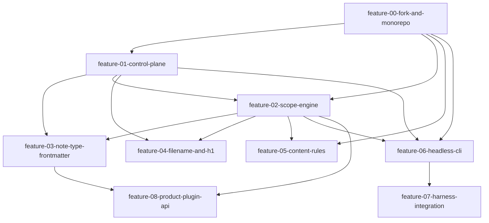

# project-tracker

## Protocol
This file is the live work state for the linter fork. Every `/pass` updates the task tables below (status values: planned, in-progress, blocked, done) and appends one line to the Log. Every `/resume` reads this file plus the latest passoff in `docs/passoffs/` before doing anything else. Task IDs are stable; never renumber. Dependencies are enforced in order: do not start a feature whose dependency column names an unfinished feature. Backlinks: [[README]].

## Dependency graph

## feature-00-fork-and-monorepo
[[feature-00-fork-and-monorepo]]
| ID | Task | Status |
| --- | --- | --- |
| F00-T1 | Fork repo, add upstream remote, branch feat/monorepo | done |
| F00-T2 | Root workspaces config, plugin code to packages/plugin | done |
| F00-T3 | Extract rules, registry, runner, utils to packages/core | done |
| F00-T4 | AppAdapter interface in core, implementation in plugin | planned |
| F00-T5 | Lang string shim in core | planned |
| F00-T6 | Repoint jest, suite green | done |
| F00-T7 | Node smoke test, zero obsidian imports | done |
| F00-T8 | CI workflow | done |

## feature-01-control-plane
[[feature-01-control-plane]]
| ID | Task | Status |
| --- | --- | --- |
| F01-T1 | Config types and JSON Schema | done |
| F01-T2 | Loader and validator, fail closed | done |
| F01-T3 | Comment-preserving serializer | done |
| F01-T4 | Plugin file watcher and reload | planned |
| F01-T5 | Settings UI writeback | planned |
| F01-T6 | data.json migration command | done |
| F01-T7 | Scaffold command | done |

## feature-02-scope-engine
[[feature-02-scope-engine]]
| ID | Task | Status |
| --- | --- | --- |
| F02-T1 | Matcher types and compiled cache | done |
| F02-T2 | Resolver, precedence, deep merge | done |
| F02-T3 | Runner integration | in-progress |
| F02-T4 | Frontmatter predicate parser | done |
| F02-T5 | linter-profile override key | done |
| F02-T6 | Resolved-profile inspector command | planned |
| F02-T7 | Golden and property suites | done |

## feature-03-note-type-frontmatter
[[feature-03-note-type-frontmatter]]
| ID | Task | Status |
| --- | --- | --- |
| F03-T1 | note-types schema and validation | done |
| F03-T2 | note-type-insert-keys rule | done |
| F03-T3 | note-type-key-sort rule | done |
| F03-T4 | note-type-validate rule | done |
| F03-T5 | date key handling with churn guard | done |
| F03-T6 | Six starter note-type fixtures | done |

## feature-04-filename-and-h1
[[feature-04-filename-and-h1]]
| ID | Task | Status |
| --- | --- | --- |
| F04-T1 | Slugger with collision strategy | done |
| F04-T2 | h1-matches-stem rule | done |
| F04-T3 | Plugin rename executor | planned |
| F04-T4 | Batch rename with dry-run | planned |
| F04-T5 | Per-scope mode setting | done |
| F04-T6 | Core link-rewriter for CLI | done |

## feature-05-content-rules
[[feature-05-content-rules]]
| ID | Task | Status |
| --- | --- | --- |
| F05-T1 | join-paragraph-lines | done |
| F05-T2 | strip-strong | done |
| F05-T3 | replace-em-dash | done |
| F05-T4 | prose-list-to-sentences | done |
| F05-T5 | Default emphasis config stanza | done |
| F05-T6 | Adversarial fixtures | done |

## feature-06-headless-cli
[[feature-06-headless-cli]]
| ID | Task | Status |
| --- | --- | --- |
| F06-T1 | Scaffold, args, config discovery | done |
| F06-T2 | check and fix commands | done |
| F06-T3 | stdin filter mode | done |
| F06-T4 | explain command | done |
| F06-T5 | json output contract v1 | done |
| F06-T6 | git-changed scoping | done |
| F06-T7 | Single-file bundle | done |
| F06-T8 | Parity and performance suites | done |

## feature-07-harness-integration
[[feature-07-harness-integration]]
| ID | Task | Status |
| --- | --- | --- |
| F07-T1 | lint-on-write.sh hook | done |
| F07-T2 | PostToolUse matcher artifact | done |
| F07-T3 | Pre-commit gate | done |
| F07-T4 | session-data lint_events ingestion | done |
| F07-T5 | /pass and /resume patches | planned |
| F07-T6 | Registry and naming artifacts | done |

## feature-08-product-plugin-api
[[feature-08-product-plugin-api]]
| ID | Task | Status |
| --- | --- | --- |
| F08-T1 | RuleProvider interface and registry | done |
| F08-T2 | Plugin registration bridge | planned |
| F08-T3 | CLI --provider loading | planned |
| F08-T4 | providers config namespace | done |
| F08-T5 | Example provider and guide | done |

## Log
2026-07-09 Plan authored. All features planned, none started.
2026-07-10 Monorepo built and green. F00 done per dec-004 (plugin stays at root, new pure core+cli workspaces; T4/T5 adapter and lang shim superseded by that decision). F01, F03, F05, F06 done. F02 done in core (resolver, matchers, precedence, golden determinism); upstream-runner call site and plugin inspector remain (T3 in-progress, T6 open). F04 core done (slugger, h1 rule, link-rewriter, flag mode); plugin rename executor T3/T4 open. F07 repo-side artifacts done and tested (hook, pre-commit, ingest, snippet, install.md); T5 applies via HC-3 in .claude. F08 core done (provider registry, config namespace, example provider plus guide); plugin bridge T2 and CLI --provider T3 open. Suite: 98 suites, 1637 tests green. CLI verified end-to-end: init, check, fix, idempotency, explain, json v1, stdin, new-rule, 30 ms bundle cold start.
